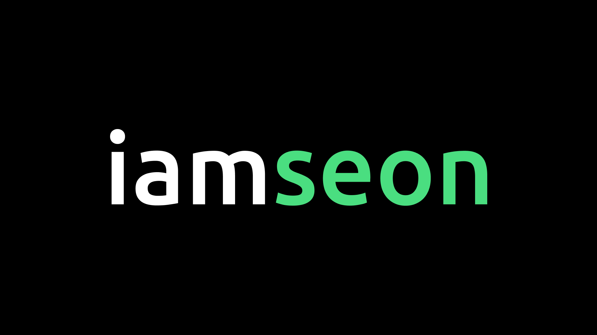

## Iamseon Blog 📮



This is fullstack blog project to share technical experience and problems that have been addressed.

## Design

- [Figma](https://www.figma.com/)
- Editor design benchmark: [Velog](https://velog.io/)

## Tech Stack

- [TypeScript](https://www.typescriptlang.org/)
- [React](https://react.dev/)
- [Next.js](https://nextjs.org/)
- [ReactQuery](https://tanstack.com/query)
- [Zustand](https://zustand.docs.pmnd.rs/)
- [CodeMirror](https://github.com/codemirror)
- [TailwindCSS](https://tailwindcss.com/)
- [Prisma](https://www.prisma.io/)
- [Vercel](https://vercel.com/)
- [Supabase](https://supabase.com/)

## Usage FSD Architecture

```
src/
├── app/
├── features/
├── views/
├── widgets/
├── shared/
```

The FSD architecture has been adopted to increase the bonding power of the project.

Learn more about FSD Architecture [here](https://iamseon.com/post/%EA%B8%B0%EB%8A%A5-%EB%B6%84%ED%95%A0-%EC%84%A4%EA%B3%84FSD-%EC%95%84%ED%82%A4%ED%85%8D%EC%B2%98%EB%A1%9C-FE-%EA%B5%AC%EC%A1%B0-%EC%B5%9C%EC%A0%81%ED%99%94%ED%95%98%EA%B8%B0)
